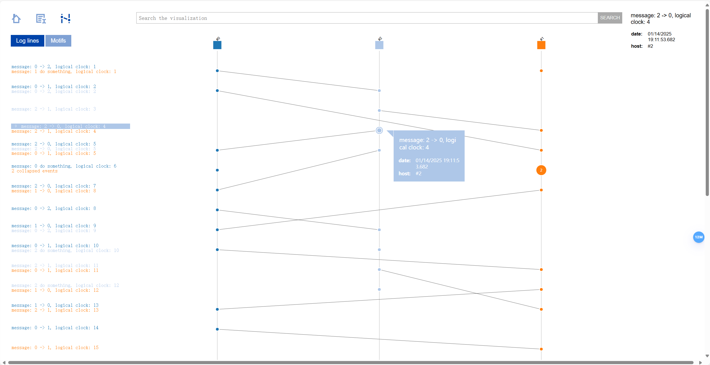

# DScope —— 分布式系统概念可视化系统

## 1. 摘要

本报告介绍了一个**分布式概念可视化系统**的设计与实现。该系统旨在通过可视化手段帮助用户理解和掌握分布式系统核心概念，例如一致性哈希、Paxos 算法、Raft 算法等。

系统由**前端界面**与**后端模拟器**组成，前端界面提供友好的交互操作和数据可视化功能，后端模拟器负责分布式算法的模拟和日志生成。

后端模拟器的扩展性极强，可以轻松添加新的分布式算法模拟器。

**日志**是本系统的核心，后端模拟器生成日志，前端通过解析日志实现可视化。

前端可以通过 docker compose 启动，后端模拟器本质上是一个 Python 包，支持 Pypi 一键下载，方便用户**使用和部署**。

评估结果表明，该系统能够有效提高用户对分布式系统概念的理解和学习效率。

**关键词:** 分布式系统，可视化，教学工具，Pypi，Docker，高度扩展性

## 2. 系统架构设计

### 2.1 系统架构概述

系统由**前端界面**与**后端模拟器**组成，前端界面提供友好的交互操作和数据可视化功能，后端模拟器负责分布式算法的模拟和日志生成。

前端可以通过 docker compose 启动，后端模拟器本质上是一个 Python 包，支持 Pypi 一键下载，方便用户**使用和部署**。

### 2.2 前端界面

前端在现有项目 [ShiViz](https://bestchai.bitbucket.io/shiviz/) 上进行修改，此项目基于 MIT 协议开源，允许我们进行二次开发。

前端界面主要提供以下功能:

1. **日志上传**

一共有两种读取日志文件的方式

用户可以通过前端界面上传后端模拟器生成的日志内容。

或者通过 Docker 的文件映射功能，将日志文件存放在 `log` 文件夹下，前端界面会自动读取这个文件夹下的日志。

2. **日志解析**

前端会对上传的日志文件进行解析，提取出日志中的关键信息，如时间戳、事件类型、事件内容等。

通过正则表达式提取出日志的 `event`、`date`、`vector-clock` 信息。

通过分析日志的 `vector-clock` 来进行事件的绘制。

3. **日志可视化**

前端会将解析后的日志信息以可视化的方式展示出来，用户可以直观地看到日志中的事件发生顺序和关系。

此部分的可视化采用 `jquery` 和 `vis.js` 实现。

前端支持 Docker 的部署，提前写好了 `Dockerfile` 和 `docker-compose.yml`。

### 2.3 日志

**日志**是本系统的核心，后端模拟器生成日志，前端通过解析日志实现可视化。

本项目使用的日志格式如下：

每个条目表示一个**事务**，包含日期、进程名、向量时钟、事件信息等。

```
[日期] [进程名] {时钟向量} 事件信息
```

如

```
[01/19/2025 22:57:29.179] [协作者#0] {"协作者#0": 1} 开始两阶段提交协议
[01/19/2025 22:57:29.180] [协作者#0] {"协作者#0": 2} 发送提交请求
[01/19/2025 22:57:29.180] [参与者#0] {"协作者#0": 2, "参与者#0": 1} 收到准备请求
[01/19/2025 22:57:29.180] [参与者#0] {"协作者#0": 2, "参与者#0": 2} 准备完成，可以提交
[01/19/2025 22:57:29.180] [协作者#0] {"协作者#0": 3} 发送提交请求
...
```

对应进行解析的**正则表达式**为

**`\[(?<date>([^ ]+ [^ ]+))\] \[(?<host>[^\]]+)\] (?<clock>.*\}) (?<event>.*)`**

此正则表达式会将 `date`、`host`、`clock`、`event` 四个部分分别解析出来，用于后续的可视化。

### 2.4 后端模拟器

后端模拟器用于模拟分布式系统中的基本概念或协议的运行过程。

目前支持模拟的分布式场景有:

- 逻辑时钟 (logical-clock)
- 向量时钟 (vector-clock)
- Paxos (paxos)
- 两阶段提交协议 (2pc)

后端模拟器的**文件架构**如下

```bash
dscope
├── __init__.py
├── __main__.py
├── settings.py
├── simulator
│   ├── __init__.py
│   ├── logical_clock.py
│   ├── paxos.py
│   ├── two_pc.py
│   └── vector_clock.py
└── utils.py
```

其中，`simulator` 文件夹下存放了各个分布式场景的模拟器代码。

## 3. 系统实现

### 3.1 DAG 图生成

DAG 图是分布式系统中常用的数据结构，用于表示任务之间的依赖关系。

本项目**完全基于** DAG 图进行分布式概念的可视化，DAG 图的生成与渲染由前端完成，采用开源库 `jquery` 和 `dagre-d3` 实现。

当前端收到日志内容后，会基于**时钟向量**对各个事务进行拓扑排序，然后根据事务之间的依赖关系生成 DAG 图。

生成的 DAG 图大致如下：

<pre>
    Pictorially:
    |  |  |     -- C is a parent of X
    A  C  E     -- X is a child of C
    | /|  |     -- A is the previous node of X. A is NOT a parent of X
    |/ |  |     -- B is the next node of X. B is NOT the child of X
    X  D  F     -- C is NOT a parent of G nor is G a child of C
    |  |\ |     -- A X B are consecutive nodes
    |  | \|     -- X is between A and B
    B  |  G
    |  |  |
</pre>

根据时钟向量，我们可以分析出各个事务之间的关系，例如：

- 前后关系。
- 父子关系。
- 并发关系。
- 连续关系。
- 无关系。

通过这些关系，我们可以更好地理解事务之间的依赖和顺序。

### 3.2 后端模拟器

后端模拟器的主要功能是模拟分布式事务的执行过程，并生成相应的时钟向量。通过时钟向量，我们可以分析出事务之间的各种关系，从而更好地理解分布式事务的执行过程。

#### 3.2.1 逻辑时钟模拟器

此部分代码位于 `dscope/simulator/logical_clock.py`。

实现了一个分布式系统中的逻辑时钟模拟器。代码定义了 `LogicalClock` 类来管理每个进程的逻辑时钟，提供了增加时间和更新时间的功能。

`Process` 类代表分布式系统中的单个进程，每个进程有自己的逻辑时钟，并能执行内部事务或发送消息给其他进程。

`simulate_distributed_system` 函数模拟了多个进程在指定步骤内的交互过程，包括消息发送和接收以及内部事件的处理。

`logical_clock_simulator` 函数从设置中获取参数并调用模拟函数，最后将事务日志转换为向量日志并保存到文件中。

整个代码通过**随机数和时间延迟**来模拟真实分布式系统中的不确定性和通信延迟。

#### 3.2.2 向量时钟模拟器

此部分代码位于 `dscope/simulator/vector_clock.py`。

此部分的代码与逻辑时钟模拟器类似，但改用向量时钟来记录事件顺序。

`Process` 类中的 `vector_clock` 属性是一个字典，用于存储每个进程的向量时钟值。

`send_message` 和 `receive_message` 方法在发送和接收消息时更新向量时钟。

整个代码通过**随机数和时间延迟**来模拟真实分布式系统中的不确定性和通信延迟。

#### 3.2.3 Paxos 模拟器

此部分代码位于 `dscope/simulator/paxos.py`。

此代码实现了一个 Paxos 算法的模拟器，用于模拟分布式系统中的共识过程。

代码定义了三个主要角色：`Proposer`(提议者)、`Acceptor`(接受者)和`Learner`(学习者)。

`Proposer` 负责生成提案号并向 `Acceptor` 发送准备请求和提案请求；

`Acceptor`负责接收并响应`Proposer`的请求，确保提案号的唯一性和一致性；

`Learner`负责从`Acceptor`中学习最终达成共识的值。

`log_transaction`函数用于记录每个事务的详细信息，包括时间戳、模式、源主机、目标主机和描述。

`simulate_paxos`函数模拟了Paxos算法的运行过程，包括提案、准备、接受和学习阶段。

`paxos_simulator`函数从设置中获取参数并调用模拟函数，最后将事务日志转换为向量日志并保存到文件中。

整个代码通过**随机数**和日志记录来模拟 Paxos 算法的执行过程，确保分布式系统中的一致性。

#### 3.2.4 两阶段提交模拟器

此部分代码位于 `dscope/simulator/two_pc.py`。

此代码实现了一个两阶段提交协议(2PC)的模拟器，用于模拟分布式系统中的事务提交过程。

代码定义了两个主要角色：`Coordinator`(协作者)和`Participant`(参与者)。

`Coordinator`负责协调事务的提交过程，包括发送准备请求和提交请求，并根据参与者的响应决定是否提交或回滚事务。

`Participant`负责接收并响应`Coordinator`的请求，包括准备、提交和回滚操作。

`log_transaction`函数用于记录每个事务的详细信息，包括时间戳、模式、源主机、目标主机和描述。

`simulate_2pc`函数模拟了两阶段提交协议的运行过程，包括准备阶段和提交阶段。

`two_pc_simulator`函数从设置中获取参数并调用模拟函数，最后将事务日志转换为向量日志并保存到文件中。

整个代码通过日志记录来模拟两阶段提交协议的执行过程，并最终将日志保存到文件中。

#### 用户自定义模拟器

本项目具有极高的可扩展性，用户可以自行设计模拟器，只需要实现 `Simulator` 接口即可。

只要满足 `Simulator` 接口，用户就可以使用本项目提供的日志记录、日志转换、日志可视化等功能。

更多信息可以通过分析 `dscope/simulator` 文件夹下的源代码来了解。

### 3.3 前端 Docker 镜像

因为前端采用纯静态网页实现，所以使用 Docker 起 Ningx 服务器来托管网页。

相关 Dockerfile 如下

```dockerfile
FROM nginx:alpine

COPY shiviz /usr/share/nginx/html

EXPOSE 80
```

其中，`shiviz`文件夹包含了前端网页的所有静态文件，`EXPOSE 80`表示暴露 80 端口。

`docker-compose.yml` 如下

```yaml
version: '3.8'

services:
  dscope_shiviz:
    build:
      context: .
      dockerfile: docker/shiviz/Dockerfile
    ports:
      - "${SHIVIZ_PORT}:80"
    container_name: dscope_shiviz_nginx
    restart: unless-stopped
    volumes:
      - ./log:/usr/share/nginx/html/log
```

它指示了将容器内的 80 端口映射到宿主机的 `${SHIVIZ_PORT}` 端口，并且将宿主机的 `./log` 文件夹挂载到容器内的 `/usr/share/nginx/html/log` 文件夹，以便前端网页可以访问到日志文件。

其中 `${SHIVIZ_PORT}` 环境变量可以通过 `.env` 文件来设置。

### 3.4 后端模拟器的 Pypi 打包

通过 `setup.py` 指示打包信息

```python
from setuptools import setup, find_packages

from dscope import __version__

setup(
    name = "dscope",
    version = __version__,
    packages = find_packages(),
    entry_points = {
        "console_scripts": [
            "dscope=dscope.__main__:main",
        ],
    },
    install_requires=[
        # 添加依赖项
    ],
)
```

本项目采用 github action 进行 python 包的便捷打包与发行，具体配置见 `.github/workflows/publish-to-pypi.yml`

可以看到，打包正常运行


相关打包信息可以在 https://pypi.org/project/dscope/ 找到


## 4. 系统演示

### 4.1 前端界面


### 4.2 逻辑时钟可视化



### 4.3 向量时钟可视化


### 4.4 Paxos 可视化


### 4.5 两阶段提交协议可视化

